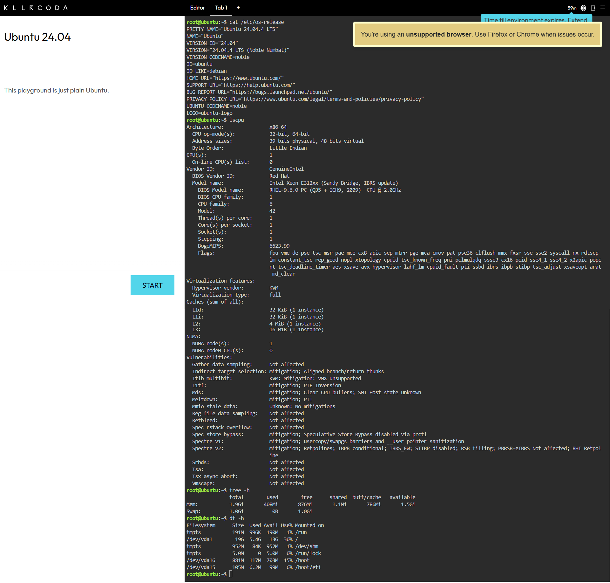

# Laboratory 03 – Multi-Cloud Explorer

## Mission

This laboratory explores AWS, Microsoft Azure, and Google Cloud Platform (GCP), compares their major services, and recommends cloud platforms for different business scenarios.

## Repository Structure

- `aws-research.md`
- `azure-research.md`
- `gcp-research.md`
- `cloud-platform-comparison.md`
- `client-recommendations.md`
- `reflection.md`
- `screenshots/`

## Linux Investigation

The Linux environment was investigated using KillerCoda.

The following commands were used:

```bash
cat /etc/os-release
lscpu
free -h
df -h
```

### Results

- **Operating System:** Ubuntu 24.04.4 LTS
- **CPU:** 1 CPU — Intel Xeon E312xx (Sandy Bridge)
- **Memory:** 1.9 GiB
- **Disk Space:** 19 GB

### Cloud Hosting Options

If this Linux server were migrated to the cloud, equivalent virtual-machine services could host it:

| Provider | Service |
|---|---|
| AWS | Amazon EC2 |
| Azure | Azure Virtual Machines |
| GCP | Compute Engine |

### KillerCoda Terminal Evidence



## Screenshots

The required screenshots are stored in the `screenshots` folder:

- `aws-homepage.png`
- `azure-homepage.png`
- `gcp-homepage.png`
- `killercoda-terminal.png`
- `github-repository.png`

## Mission Tasks Completed

### Checkpoint 1 – Expand Your Cloud Portfolio

The Laboratory 03 folder contains the required Markdown documentation and screenshots folder.

### Checkpoint 2 – Explore the Three Cloud Platforms

Research was completed for:
- Amazon Web Services (AWS)
- Microsoft Azure
- Google Cloud Platform (GCP)

Each platform has a dedicated research document covering its overview, infrastructure, management console, core services, advantages, and enterprise use cases.

### Checkpoint 3 – Compare the Major Cloud Platforms

AWS, Azure, and GCP were compared based on:
- Launch year
- Compute service
- Storage service
- Networking service
- Identity service
- Primary strength
- Ideal organizations

The required comparison questions are answered in `cloud-platform-comparison.md`.

### Checkpoint 4 – Cloud Platform Recommendation Challenge

Cloud platforms were recommended for:
- Startup Company
- University
- AI Research Company
- Global E-Commerce Company

The recommendations and supporting services are documented in `client-recommendations.md`.

### Checkpoint 5 – Match the Cloud Services

Equivalent services across AWS, Azure, and GCP were matched for:
- Virtual Machines
- Object Storage
- Identity Management
- SQL Database
- Kubernetes

The service comparison table is included in `cloud-platform-comparison.md`.

### Checkpoint 6 – Multi-Cloud Decision Matrix

A decision matrix was created for:
- Startup Company
- Enterprise Organization
- Microsoft Environment
- AI / Machine Learning
- Kubernetes Deployment
- Global Web Application

The matrix is included in `client-recommendations.md`.

### Checkpoint 7 – Continue Your Linux Investigation

KillerCoda was used to identify the Linux operating system, CPU, memory, and disk space.

The results are documented above, and the terminal screenshot is included as evidence.

### Checkpoint 8 – Mission Reflection

A reflection covering the required five questions is provided in `reflection.md`.

## Conclusion

This laboratory provided practical experience in comparing AWS, Microsoft Azure, and Google Cloud Platform. It also demonstrated how business requirements and technical needs influence cloud platform selection.
